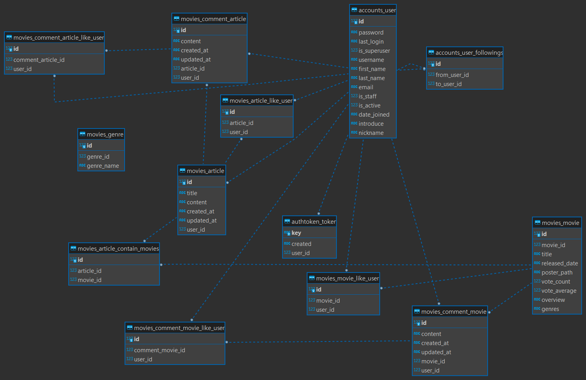

# 무:플리 프로젝트

# 프로젝트 소개

  음악만 플레이리스트가 있나? 영화도 있다!

  영화에 대해 이야기하는 사람들이 모이는 영화 추천 및 소통 커뮤니티 사이트

  <br>

# 개발 기간

- 23.05.18 - 23.05.25 (7일)

<br>

## 팀원 정보 및 업무 분담
  
| 이름   | 담당 영역                                                    | 
| ------ | ------------------------------------------------------------ | 
| 황종인 | - 프론트엔드(70%) / 백엔드(30%)<br />- 백엔드 데이터를 받아와 프론트엔드 기능 구현 및 디버깅, 테스트 |
| 이은석 | - 프론트엔드(30%) / 백엔드(70%)<br />- DB 모델링, 백엔드 데이터 로직 작성, 프론트엔드 디자인 정교화 |

## 개발 환경

   
   
   
  
   
  
  


### 💻 필수 요구사항

| No.  | 구분               | 기능                                 | 구현 정도(⭐⭐⭐⭐⭐)                                            |
| ---- | ------------------ | ------------------------------------ | ----------------------------------------------------------- |
| 1    | 영화 데이터         | 최소 50개 이상 존재           | ⭐⭐⭐⭐⭐                                                       |
| 2    |                    | 데이터 fixture에 저장         | ⭐⭐⭐⭐⭐                                                       |
| 3    | 추천 알고리즘       | 최소 1개 이상의 영화를 추천 받아야함 | ⭐⭐⭐⭐⭐                                                  |
| 4    |                    | 추천 알고리즘 기술적 설명            | ⭐⭐⭐⭐⭐                                                  |
| 5    | 커뮤니티           | 유저가 소통할 수 있는 커뮤니티 기능  | ⭐⭐⭐⭐⭐                                                    |
| 6    | 에러 페이지           |필요에 따라 적절한 에러 페이지 구성   | ⭐⭐⭐⭐⭐                                                    |


# 목표 서비스 구현 및 실제 구현 정도

  1. 신작 & 개봉 예정인 영화 목록
  2. 평점 높은 영화 목록
  3. 장르로 필터링한 목록 보여주는 페이지
    - (영화 이름으로 검색하는 기능)
  4. 영화 플레이리스트를 공유하는 커뮤니티
    - 댓글, 대댓글, 좋아요 기능
    - 인기 플레이리스트를 홈 화면에 노출시키기?

  
# 데이터베이스 모델링 (ERD)




# 개발 일지
| No.  | Date     | Name   | ToDo                                                         | 
| ---- | -------- | ------ | ------------------------------------------------------------ | 
| |~23/5/21| 이은석&황종인 | 기본 기능 구현<br> 디자인, 컨셉 설정 |
| |23/5/22 | 이은석 | 팔로우 버튼 디테일 <br> 데이터 베이스 runserver 시 자동 갱신|  
| | 23/5/22 | 황종인 | 로그인 시 state에 로그인한 유저 정보 저장<br> 게시글,댓글 좋아요 기능| 
| |23/5/23 | 이은석 | 영화 디테일 modal 제작<br> 장르 모델 추가<br> 장르 한글 데이터를 store 저장<br> 장르 필터링 버튼 제작 <br> 장르로 영화 필터링 기능 구현  |  
| | 23/5/23 | 황종인 | 게시글 모델 movies M:N연결<br> 플레이리스트에 영화 포스터 미리보기 제작 <br> 프로필 페이지에 작성한 플레이리스트, 팔로우,팔로잉, 정보 출력 <br>  | 
| |23/5/24 | 이은석 | 영화 데이터 overlay로 제목 보여주기 구현 <br> 홈에서 영화 보여주는 방식 스크롤 사용 <br> 팔로우한 사람의 플레이리스트 보여주기 구현 <br> 좋아요 수가 많은 플레이리스트 보여주기 <br> 플레이 리스트 카드 모양 디자인 <br> | 
| | 23/5/24 | 황종인 | 유저가 만든 플레이리스트 홈화면에 출력<br> 플레이리스트 각족 버튼 위치 디자인 수정 <br> 회원가입 시 메시지 출력 <br> 로그인 시에만 접근 가능한 페이지 설정 <br>|
| |23/5/25 | 이은석 | 전체 배경색 설정 <br> Nav bar 하나로 적용 <br> 프로필 페이지 CSS 적용 <br> 회원가입, 로그인 페이지 CSS 적용 <br> 전체적 버그 수정, CSS 수정 |
| | 23/5/25 | 황종인 | 작성시각, 수정시각 포맷팅 <br> 플레이리스트에 영화 담을 때 중복 제거 <br> 팔로우 플레이리스트 작성자 이름과 작성 시간 출력 <br> 버그 수정, css 수정  |


# 영화 추천 알고리즘에 대한 기술적 설명

1. 유저들이 작성한 플레이리스트 중 좋아요가 가장 많은 3개의 인기 플레이리스트 추천

  - final-pjt-front/src/components/ReviewPopular.vue

  - 메인 알고리즘

    전체 플레이리스트를 좋아요 기준 순으로 정렬 시키고 좋아요 수가 가장 많은 세개만 각자 출력

  ```javascript

    sortedArticles() {
        const newArticles = []
        for (const article of this.$store.state.articles) {
          newArticles.push(article)
        }

        let editArticles = newArticles.sort(function(a,b){
          return b.like_user.length - a.like_user.length
        })
        return editArticles
      },

  ```

2. 자신이 팔로우한 사람들의 최신 순서로 플레이리스트 추천


FollowPlaylist.vue
- 최근 게시글부터 탐색을 해서 게시글의 작성자가 접속한 유저가 팔로잉한 유저인 경우 게시글의 작성자를 포함한 데이터를 가공하여 리스트에 저장하고 가장 최근의 게시글이 출력되면서 작성한 유저까지 보이도록 만듦 

```javascript
  getArticles(){
      // 팔로잉한 사람의 게시글을 최근 게시글부터 탐색
      const reverse = [...this.Articles].reverse()
      for (const article of reverse) {
          if (this.currentUser.followings.includes(article.user)) {
              this.followingArticles.push(article)
                axios({
                    method: 'get',
                    url: `${API_URL}/accounts/user/detail/${article.user}/`,
                    headers: {
                        Authorization: `Token ${ this.token }`,
                    }    
                })
                .then((res) => {
                    const userInfo = {
                        ...article,
                        username: res.data.username
                    }
                    this.followingArticlesPlusAuthor.push(userInfo)
                })
                .catch(err => console.log(err))
                
              }
              
          }
      },

```

# 서비스 대표 기능에 대한 설명

- 

# 기타 (느낀 점, 후기)